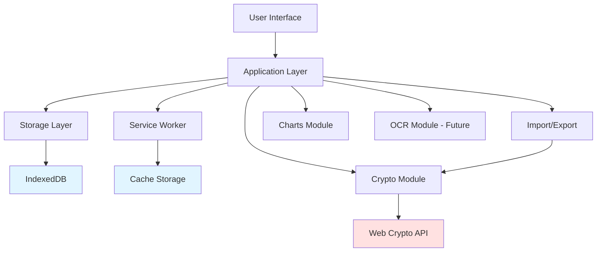

# Offline Budget PWA - Technical Specification

**Version:** 1.0  
**Last Updated:** 2026-05-01  
**Target Platform:** GitHub Pages (Static Hosting)  
**Architecture:** Local-First, Offline-Capable PWA

---

## 1. Executive Summary

This specification defines a privacy-focused, offline-first budgeting Progressive Web App (PWA) that runs entirely in the browser with no backend dependencies. All data is stored locally in IndexedDB, with optional encrypted export/import for cross-device transfer.

### Key Characteristics
- **Zero Backend**: Pure client-side application hosted on GitHub Pages
- **Offline-First**: Full functionality without network connectivity
- **Privacy-Focused**: No tracking, no accounts, no data leaves device except via user-initiated encrypted export
- **Cross-Device**: Manual encrypted backup/restore workflow
- **Modern Stack**: TypeScript, Vite, IndexedDB (idb), Web Crypto API

---

## 2. Architecture Overview



### Technology Stack

| Layer | Technology | Purpose |
|-------|-----------|---------|
| **Build Tool** | Vite 5.x | Fast dev server, optimized production builds |
| **Language** | TypeScript 5.x | Type safety, better DX |
| **UI Framework** | Vanilla TS + Web Components | Lightweight, no framework overhead |
| **Storage** | IndexedDB via `idb` 8.x | Durable local storage |
| **PWA** | Workbox 7.x | Service worker generation, caching strategies |
| **Encryption** | Web Crypto API (AES-256-GCM) | Client-side backup encryption |
| **Charts** | Chart.js 4.x (lazy-loaded) | Data visualization |
| **Testing** | Vitest + Playwright | Unit, integration, E2E tests |
| **CI/CD** | GitHub Actions | Automated build, test, deploy |

---

## 3. Data Model

### 3.1 Core Entities

#### Transaction
```typescript
interface Transaction {
  id: string;                    // UUID v4
  amount: number;                // Stored in smallest currency unit (cents)
  currency: string;              // ISO 4217 code (USD, EUR, etc.)
  date: string;                  // ISO 8601 timestamp
  category: string;              // Category ID reference
  merchant?: string;             // Merchant name
  paymentMethod?: string;        // Cash, Credit Card, Debit, etc.
  tags: string[];                // Array of tag strings
  note?: string;                 // User notes
  receiptId?: string;            // Reference to Receipt entity
  splits?: TransactionSplit[];   // For split transactions
  recurring?: RecurringConfig;   // If part of recurring series
  createdAt: string;             // ISO 8601 timestamp
  updatedAt: string;             // ISO 8601 timestamp
  version: number;               // For conflict resolution
}

interface TransactionSplit {
  categoryId: string;
  amount: number;                // Must sum to transaction.amount
  note?: string;
}

interface RecurringConfig {
  seriesId: string;              // Links recurring instances
  frequency: 'daily' | 'weekly' | 'monthly' | 'yearly';
  interval: number;              // Every N days/weeks/months
  endDate?: string;              // Optional end date
  nextOccurrence: string;        // Next scheduled date
}
```

#### Category
```typescript
interface Category {
  id: string;                    // UUID v4
  name: string;                  // Display name
  color: string;                 // Hex color code
  icon: string;                  // Icon identifier or emoji
  parentId?: string;             // For subcategories
  budget?: CategoryBudget;       // Optional budget settings
  isSystem: boolean;             // System categories can't be deleted
  createdAt: string;
  updatedAt: string;
  version: number;
}

interface CategoryBudget {
  amount: number;                // Budget amount in smallest unit
  period: 'daily' | 'weekly' | 'monthly';
  rollover: boolean;             // Allow unused budget to roll over
  alertThreshold: number;        // Alert at N% of budget (0-100)
}
```

#### Receipt
```typescript
interface Receipt {
  id: string;                    // UUID v4
  transactionId: string;         // Parent transaction
  blob: Blob;                    // Image data
  mimeType: string;              // image/jpeg, image/png, etc.
  size: number;                  // Bytes
  thumbnail?: Blob;              // Smaller preview (max 200x200)
  ocrText?: string;              // Extracted text (future feature)
  createdAt: string;
}
```

#### Budget
```typescript
interface Budget {
  id: string;                    // UUID v4
  name: string;                  // Budget name
  amount: number;                // Total budget amount
  period: 'daily' | 'weekly' | 'monthly';
  startDate: string;             // Period start
  categories: string[];          // Category IDs included
  rollover: boolean;
  alertThreshold: number;
  createdAt: string;
  updatedAt: string;
}
```

#### AppSettings
```typescript
interface AppSettings {
  id: 'settings';                // Singleton
  defaultCurrency: string;       // ISO 4217 code
  currencies: CurrencyConfig[];  // Supported currencies
  defaultCategory?: string;      // Quick-add default
  theme: 'light' | 'dark' | 'auto';
  locale: string;                // BCP 47 language tag
  dateFormat: string;            // Date display format
  firstDayOfWeek: 0 | 1;         // 0=Sunday, 1=Monday
  receiptMaxSize: number;        // Max bytes per receipt
  storageQuotaWarning: number;   // Warn at N% of quota
  analyticsEnabled: boolean;     // Opt-in analytics
  lastBackupDate?: string;       // Last export timestamp
  version: string;               // App version
}

interface CurrencyConfig {
  code: string;                  // ISO 4217
  symbol: string;                // Display symbol
  rate: number;                  // Conversion rate to base currency
  decimals: number;              // Decimal places
}
```

### 3.2 IndexedDB Schema

**Database Name:** `BudgetAppDB`  
**Version:** 1

```typescript
const DB_SCHEMA = {
  transactions: {
    keyPath: 'id',
    indexes: [
      { name: 'date', keyPath: 'date' },
      { name: 'category', keyPath: 'category' },
      { name: 'merchant', keyPath: 'merchant' },
      { name: 'createdAt', keyPath: 'createdAt' }
    ]
  },
  categories: {
    keyPath: 'id',
    indexes: [
      { name: 'name', keyPath: 'name', unique: true }
    ]
  },
  receipts: {
    keyPath: 'id',
    indexes: [
      { name: 'transactionId', keyPath: 'transactionId' }
    ]
  },
  budgets: {
    keyPath: 'id',
    indexes: [
      { name: 'period', keyPath: 'period' }
    ]
  },
  settings: {
    keyPath: 'id'  // Singleton store
  },
  undoStack: {
    keyPath: 'id',
    indexes: [
      { name: 'timestamp', keyPath: 'timestamp' }
    ]
  }
};
```

---

## 4. Storage Layer Architecture

See [`storage-layer.md`](storage-layer.md) for complete implementation.

### Key Features
- Atomic transactions with rollback support
- Indexed queries for fast lookups
- Undo/redo stack (last 50 actions)
- Storage quota monitoring
- Automatic initialization with default categories

---

## 5. Encryption & Export/Import

See [`encryption-spec.md`](encryption-spec.md) for complete implementation.

### 5.1 Encryption Strategy

- **Algorithm**: AES-256-GCM (Web Crypto API)
- **Key Derivation**: PBKDF2 with 100,000 iterations
- **Salt**: 16 bytes random per backup
- **IV**: 12 bytes random per backup

### 5.2 Backup Format

```typescript
interface EncryptedBackup {
  version: string;              // Backup format version
  timestamp: string;            // ISO 8601
  salt: string;                 // Base64 encoded
  iv: string;                   // Base64 encoded
  data: string;                 // Base64 encoded encrypted data
  manifest: BackupManifest;
}

interface BackupManifest {
  appVersion: string;
  transactionCount: number;
  categoryCount: number;
  budgetCount: number;
  receiptCount: number;
  totalSize: number;            // Bytes
}
```

### 5.3 Import Strategies

- **Replace**: Clear all existing data, restore from backup
- **Merge**: Keep newer versions based on `version` field, resolve conflicts

---

## 6. PWA Configuration

### 6.1 Service Worker Strategy

```typescript
// Workbox configuration
{
  registerType: 'autoUpdate',
  workbox: {
    globPatterns: ['**/*.{js,css,html,ico,png,svg,woff2}'],
    runtimeCaching: [
      {
        urlPattern: /^https:\/\/fonts\.googleapis\.com\/.*/i,
        handler: 'CacheFirst',
        options: {
          cacheName: 'google-fonts-cache',
          expiration: {
            maxEntries: 10,
            maxAgeSeconds: 60 * 60 * 24 * 365
          }
        }
      }
    ]
  }
}
```

### 6.2 Manifest

```json
{
  "name": "Budget Tracker - Offline Budget Manager",
  "short_name": "Budget",
  "description": "Privacy-focused offline budget tracker with encrypted backups",
  "theme_color": "#4ECDC4",
  "background_color": "#ffffff",
  "display": "standalone",
  "orientation": "portrait",
  "scope": "/",
  "start_url": "/",
  "categories": ["finance", "productivity"],
  "icons": [
    {
      "src": "/pwa-192x192.png",
      "sizes": "192x192",
      "type": "image/png"
    },
    {
      "src": "/pwa-512x512.png",
      "sizes": "512x512",
      "type": "image/png",
      "purpose": "any maskable"
    }
  ]
}
```

---

## 7. Project Structure

```
budget-pwa/
├── .github/
│   └── workflows/
│       └── deploy.yml           # CI/CD pipeline
├── public/
│   ├── manifest.json
│   ├── robots.txt
│   ├── favicon.ico
│   ├── pwa-192x192.png
│   └── pwa-512x512.png
├── src/
│   ├── components/              # UI components
│   │   ├── TransactionForm.ts
│   │   ├── TransactionList.ts
│   │   ├── CategoryManager.ts
│   │   ├── BudgetTracker.ts
│   │   ├── ExportImport.ts
│   │   ├── Charts.ts
│   │   └── OnlineIndicator.ts
│   ├── crypto/
│   │   └── encryption.ts        # Encryption service
│   ├── services/
│   │   ├── import-export.ts     # Import/export logic
│   │   ├── recurring.ts         # Recurring transactions
│   │   ├── budget-calculator.ts # Budget calculations
│   │   └── search.ts            # Search & filter
│   ├── storage/
│   │   └── db.ts                # IndexedDB wrapper
│   ├── types/
│   │   └── index.ts             # TypeScript interfaces
│   ├── utils/
│   │   ├── currency.ts          # Currency formatting
│   │   ├── date.ts              # Date utilities
│   │   └── validation.ts        # Input validation
│   ├── styles/
│   │   ├── main.css
│   │   ├── themes.css
│   │   └── components.css
│   ├── main.ts                  # App entry point
│   ├── router.ts                # Client-side routing
│   └── index.html
├── tests/
│   ├── unit/
│   │   ├── storage.test.ts
│   │   ├── encryption.test.ts
│   │   └── currency.test.ts
│   ├── integration/
│   │   ├── import-export.test.ts
│   │   └── transactions.test.ts
│   └── e2e/
│       ├── pwa-install.spec.ts
│       └── offline.spec.ts
├── .gitignore
├── package.json
├── tsconfig.json
├── vite.config.ts
├── vitest.config.ts
├── playwright.config.ts
└── README.md
```

---

## 8. Security & Privacy

### 8.1 Security Measures

1. **Content Security Policy (CSP)**
   ```html
   <meta http-equiv="Content-Security-Policy" 
         content="default-src 'self'; 
                  script-src 'self'; 
                  style-src 'self' 'unsafe-inline'; 
                  img-src 'self' data: blob:; 
                  font-src 'self' https://fonts.gstatic.com;">
   ```

2. **Input Validation**
   - Sanitize all user inputs
   - Validate amounts (positive numbers, max 2 decimals)
   - Validate dates (ISO 8601 format)
   - Limit string lengths (merchant: 100 chars, note: 500 chars)

3. **Encryption**
   - AES-256-GCM for backups
   - PBKDF2 with 100,000 iterations
   - Random salt and IV per backup

4. **Storage Security**
   - No sensitive data in localStorage
   - IndexedDB for all app data
   - Encrypted backups only

### 8.2 Privacy Measures

1. **No Tracking**
   - No analytics by default
   - Opt-in privacy-preserving analytics only
   - No third-party scripts

2. **No Accounts**
   - No user registration
   - No authentication
   - No server-side storage

3. **Data Ownership**
   - All data stays on device
   - User controls exports
   - Encrypted backups with user passphrase

---

## 9. Performance Targets

| Metric | Target |
|--------|--------|
| **Initial Load** | < 2s on 3G |
| **Core Bundle** | < 200 KB gzipped |
| **Time to Interactive** | < 3s |
| **First Contentful Paint** | < 1.5s |
| **Lighthouse Score** | > 90 (all categories) |

### Code Splitting Strategy

```typescript
// Lazy load heavy modules
const Chart = () => import('chart.js');
const Tesseract = () => import('tesseract.js'); // Future OCR
```

---

## 10. Accessibility (WCAG 2.1 AA)

- Semantic HTML5 elements
- ARIA labels for interactive elements
- Keyboard navigation support
- Focus indicators
- Color contrast ratio > 4.5:1
- Screen reader tested
- Responsive text sizing

---

## 11. Browser Support

| Browser | Minimum Version |
|---------|----------------|
| Chrome | 90+ |
| Edge | 90+ |
| Firefox | 88+ |
| Safari | 14+ |

### Required APIs
- IndexedDB
- Service Workers
- Web Crypto API
- Cache API
- Notifications API (optional)

---

## 12. Testing Strategy

See [`test-plan.md`](test-plan.md) for complete test plan.

### Test Coverage Targets
- Unit tests: > 80% coverage
- Integration tests: Critical paths
- E2E tests: User workflows

---

## 13. Deployment

See [`deployment-guide.md`](deployment-guide.md) for complete instructions.

### GitHub Pages Setup
1. Build production bundle
2. Deploy to `gh-pages` branch
3. Configure custom domain (optional)
4. Enable HTTPS

---

## 14. Future Enhancements

- OCR for receipt text extraction (Tesseract.js)
- Budget forecasting with ML
- Multi-device sync via WebRTC
- Export to PDF reports
- Voice input for quick add
- Biometric authentication for app lock

---

## Next Steps

1. Review and approve this specification
2. Set up project repository
3. Implement storage layer
4. Build core UI components
5. Implement encryption module
6. Add PWA features
7. Write tests
8. Deploy to GitHub Pages
