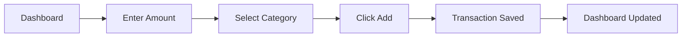
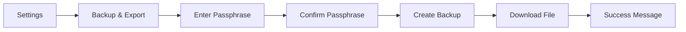
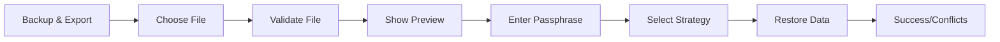
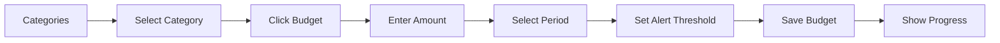

# UI/UX Wireframes & User Flows

Complete user interface design and interaction flows for the Budget PWA.

## Design Principles

1. **Mobile-First**: Design for mobile, enhance for desktop
2. **Offline-First**: Clear indicators of sync/offline status
3. **Quick Actions**: Fast access to common tasks
4. **Visual Feedback**: Immediate response to user actions
5. **Accessibility**: WCAG 2.1 AA compliant

## Color Palette

```css
:root {
  /* Primary Colors */
  --primary: #4ECDC4;
  --primary-dark: #3AAFA9;
  --primary-light: #7FE5E0;
  
  /* Accent Colors */
  --accent: #FF6B6B;
  --success: #51CF66;
  --warning: #FFD93D;
  --error: #FF6B6B;
  
  /* Neutral Colors */
  --background: #FFFFFF;
  --surface: #F8F9FA;
  --text-primary: #212529;
  --text-secondary: #6C757D;
  --border: #DEE2E6;
  
  /* Dark Mode */
  --dark-background: #1A1A1A;
  --dark-surface: #2D2D2D;
  --dark-text-primary: #F8F9FA;
  --dark-text-secondary: #ADB5BD;
  --dark-border: #495057;
}
```

## Main Screens

### 1. Dashboard (Home)

```
┌─────────────────────────────────────────────┐
│  Budget Tracker          [●] [☰]            │
├─────────────────────────────────────────────┤
│                                             │
│  ┌─────────────────────────────────────┐   │
│  │  This Month                         │   │
│  │  $1,234.56 / $2,000.00             │   │
│  │  ████████████░░░░░░░░░░ 62%        │   │
│  │  $765.44 remaining                  │   │
│  └─────────────────────────────────────┘   │
│                                             │
│  Quick Add                                  │
│  ┌─────────────────────────────────────┐   │
│  │ $ [Amount]        [Category ▼]     │   │
│  │ [Merchant]        [+ Add]          │   │
│  └─────────────────────────────────────┘   │
│                                             │
│  Recent Transactions                        │
│  ┌─────────────────────────────────────┐   │
│  │ 🍔 Starbucks           -$5.99      │   │
│  │ Food & Dining          Today       │   │
│  ├─────────────────────────────────────┤   │
│  │ 🚗 Shell Gas           -$45.00     │   │
│  │ Transportation         Yesterday   │   │
│  ├─────────────────────────────────────┤   │
│  │ 🛍️ Amazon             -$89.99     │   │
│  │ Shopping               May 28      │   │
│  └─────────────────────────────────────┘   │
│                                             │
│  [View All Transactions]                    │
│                                             │
├─────────────────────────────────────────────┤
│  [🏠] [📊] [➕] [📁] [⚙️]                   │
└─────────────────────────────────────────────┘
```

**Key Features:**
- Budget progress bar with visual indicator
- Quick-add form for fast entry
- Recent transactions list
- Bottom navigation bar
- Online/offline indicator (●)

### 2. Add/Edit Transaction

```
┌─────────────────────────────────────────────┐
│  ← Add Transaction                          │
├─────────────────────────────────────────────┤
│                                             │
│  Amount *                                   │
│  ┌─────────────────────────────────────┐   │
│  │ $ 45.99                             │   │
│  └─────────────────────────────────────┘   │
│                                             │
│  Category *                                 │
│  ┌─────────────────────────────────────┐   │
│  │ 🍔 Food & Dining              ▼    │   │
│  └─────────────────────────────────────┘   │
│                                             │
│  Date & Time                                │
│  ┌──────────────────┬──────────────────┐   │
│  │ 05/01/2026      │ 2:30 PM         │   │
│  └──────────────────┴──────────────────┘   │
│                                             │
│  Merchant                                   │
│  ┌─────────────────────────────────────┐   │
│  │ Starbucks                           │   │
│  └─────────────────────────────────────┘   │
│                                             │
│  Payment Method                             │
│  ┌─────────────────────────────────────┐   │
│  │ Credit Card                    ▼   │   │
│  └─────────────────────────────────────┘   │
│                                             │
│  Tags                                       │
│  ┌─────────────────────────────────────┐   │
│  │ [coffee] [morning] [+]              │   │
│  └─────────────────────────────────────┘   │
│                                             │
│  Note                                       │
│  ┌─────────────────────────────────────┐   │
│  │ Morning coffee before work          │   │
│  └─────────────────────────────────────┘   │
│                                             │
│  Receipt                                    │
│  ┌─────────────────────────────────────┐   │
│  │ [📷 Add Photo] [📎 Attach File]    │   │
│  └─────────────────────────────────────┘   │
│                                             │
│  ☐ Split Transaction                        │
│  ☐ Make Recurring                           │
│                                             │
│  ┌─────────────────────────────────────┐   │
│  │         [Save Transaction]          │   │
│  └─────────────────────────────────────┘   │
│                                             │
└─────────────────────────────────────────────┘
```

**Key Features:**
- Required fields marked with *
- Auto-suggest for merchant names
- Tag management with quick add
- Receipt attachment options
- Split transaction toggle
- Recurring transaction setup

### 3. Transactions List

```
┌─────────────────────────────────────────────┐
│  ← Transactions                [🔍] [⋮]     │
├─────────────────────────────────────────────┤
│                                             │
│  Filters: [All] [This Month ▼] [Clear]     │
│                                             │
│  ┌─────────────────────────────────────┐   │
│  │ Today                               │   │
│  ├─────────────────────────────────────┤   │
│  │ 🍔 Starbucks           -$5.99      │   │
│  │ Food & Dining          2:30 PM     │   │
│  │ [Credit Card]                       │   │
│  ├─────────────────────────────────────┤   │
│  │ 🚗 Shell Gas           -$45.00     │   │
│  │ Transportation         10:15 AM    │   │
│  │ [Debit Card]                        │   │
│  └─────────────────────────────────────┘   │
│                                             │
│  ┌─────────────────────────────────────┐   │
│  │ Yesterday                           │   │
│  ├─────────────────────────────────────┤   │
│  │ 🛍️ Amazon             -$89.99     │   │
│  │ Shopping               3:45 PM     │   │
│  │ [Credit Card]                       │   │
│  ├─────────────────────────────────────┤   │
│  │ 💡 Electric Bill       -$125.00    │   │
│  │ Bills & Utilities      9:00 AM     │   │
│  │ [Auto-pay]                          │   │
│  └─────────────────────────────────────┘   │
│                                             │
│  Total: -$265.98                            │
│                                             │
├─────────────────────────────────────────────┤
│  [🏠] [📊] [➕] [📁] [⚙️]                   │
└─────────────────────────────────────────────┘
```

**Key Features:**
- Grouped by date
- Quick filters
- Search functionality
- Swipe actions (edit/delete)
- Running total

### 4. Categories Management

```
┌─────────────────────────────────────────────┐
│  ← Categories                  [+ New]      │
├─────────────────────────────────────────────┤
│                                             │
│  ┌─────────────────────────────────────┐   │
│  │ 🍔 Food & Dining                    │   │
│  │ $234.56 / $500.00 (47%)            │   │
│  │ ████████░░░░░░░░░░░░                │   │
│  │ [Edit] [Budget]                     │   │
│  ├─────────────────────────────────────┤   │
│  │ 🚗 Transportation                   │   │
│  │ $156.00 / $300.00 (52%)            │   │
│  │ ██████████░░░░░░░░░░                │   │
│  │ [Edit] [Budget]                     │   │
│  ├─────────────────────────────────────┤   │
│  │ 🛍️ Shopping                        │   │
│  │ $89.99 / $200.00 (45%)             │   │
│  │ █████████░░░░░░░░░░░                │   │
│  │ [Edit] [Budget]                     │   │
│  ├─────────────────────────────────────┤   │
│  │ 🎬 Entertainment                    │   │
│  │ No budget set                       │   │
│  │ [Edit] [Set Budget]                 │   │
│  └─────────────────────────────────────┘   │
│                                             │
│  [Merge Categories]                         │
│                                             │
├─────────────────────────────────────────────┤
│  [🏠] [📊] [➕] [📁] [⚙️]                   │
└─────────────────────────────────────────────┘
```

**Key Features:**
- Visual budget progress per category
- Quick edit and budget setup
- Category merge functionality
- Color-coded categories

### 5. Reports & Charts

```
┌─────────────────────────────────────────────┐
│  ← Reports                    [Export]      │
├─────────────────────────────────────────────┤
│                                             │
│  Period: [This Month ▼]                     │
│                                             │
│  Summary                                    │
│  ┌─────────────────────────────────────┐   │
│  │ Total Spent:        $1,234.56       │   │
│  │ Budget:             $2,000.00       │   │
│  │ Remaining:          $765.44         │   │
│  │ Daily Average:      $41.15          │   │
│  └─────────────────────────────────────┘   │
│                                             │
│  Spending by Category                       │
│  ┌─────────────────────────────────────┐   │
│  │        [Pie Chart]                  │   │
│  │                                     │   │
│  │    🍔 Food: 35%                     │   │
│  │    🚗 Transport: 25%                │   │
│  │    🛍️ Shopping: 20%                │   │
│  │    💡 Bills: 15%                    │   │
│  │    📦 Other: 5%                     │   │
│  └─────────────────────────────────────┘   │
│                                             │
│  Spending Trend                             │
│  ┌─────────────────────────────────────┐   │
│  │        [Line Chart]                 │   │
│  │                                     │   │
│  │    Week 1  Week 2  Week 3  Week 4  │   │
│  └─────────────────────────────────────┘   │
│                                             │
│  Top Merchants                              │
│  ┌─────────────────────────────────────┐   │
│  │ 1. Amazon          $189.99          │   │
│  │ 2. Shell Gas       $145.00          │   │
│  │ 3. Starbucks       $89.50           │   │
│  └─────────────────────────────────────┘   │
│                                             │
├─────────────────────────────────────────────┤
│  [🏠] [📊] [➕] [📁] [⚙️]                   │
└─────────────────────────────────────────────┘
```

**Key Features:**
- Period selector
- Summary statistics
- Interactive charts (lazy-loaded)
- Top merchants list
- Export functionality

### 6. Backup & Export

```
┌─────────────────────────────────────────────┐
│  ← Backup & Export                          │
├─────────────────────────────────────────────┤
│                                             │
│  Last Backup: May 1, 2026 at 2:30 PM       │
│                                             │
│  Create Encrypted Backup                    │
│  ┌─────────────────────────────────────┐   │
│  │ Secure your data with a passphrase  │   │
│  │                                     │   │
│  │ Passphrase:                         │   │
│  │ ┌─────────────────────────────┐     │   │
│  │ │ ••••••••••••                │     │   │
│  │ └─────────────────────────────┘     │   │
│  │ Strength: ████████░░ Strong         │   │
│  │                                     │   │
│  │ Confirm Passphrase:                 │   │
│  │ ┌─────────────────────────────┐     │   │
│  │ │ ••••••••••••                │     │   │
│  │ └─────────────────────────────┘     │   │
│  │                                     │   │
│  │ [Create Backup]                     │   │
│  └─────────────────────────────────────┘   │
│                                             │
│  Restore from Backup                        │
│  ┌─────────────────────────────────────┐   │
│  │ [Choose File]                       │   │
│  │                                     │   │
│  │ Strategy:                           │   │
│  │ ○ Merge with existing data          │   │
│  │ ● Replace all data                  │   │
│  │                                     │   │
│  │ [Restore Backup]                    │   │
│  └─────────────────────────────────────┘   │
│                                             │
│  Export Options                             │
│  ┌─────────────────────────────────────┐   │
│  │ [Export to CSV]                     │   │
│  │ [Export PDF Report] (Future)        │   │
│  └─────────────────────────────────────┘   │
│                                             │
├─────────────────────────────────────────────┤
│  [🏠] [📊] [➕] [📁] [⚙️]                   │
└─────────────────────────────────────────────┘
```

**Key Features:**
- Last backup timestamp
- Passphrase strength indicator
- Merge vs. replace strategy
- Multiple export formats

### 7. Settings

```
┌─────────────────────────────────────────────┐
│  ← Settings                                 │
├─────────────────────────────────────────────┤
│                                             │
│  General                                    │
│  ┌─────────────────────────────────────┐   │
│  │ Default Currency                    │   │
│  │ USD ($)                        ▼   │   │
│  ├─────────────────────────────────────┤   │
│  │ Date Format                         │   │
│  │ MM/DD/YYYY                     ▼   │   │
│  ├─────────────────────────────────────┤   │
│  │ First Day of Week                   │   │
│  │ Sunday                         ▼   │   │
│  └─────────────────────────────────────┘   │
│                                             │
│  Appearance                                 │
│  ┌─────────────────────────────────────┐   │
│  │ Theme                               │   │
│  │ ○ Light  ● Auto  ○ Dark            │   │
│  └─────────────────────────────────────┘   │
│                                             │
│  Currency Management                        │
│  ┌─────────────────────────────────────┐   │
│  │ USD  $    1.00                      │   │
│  │ EUR  €    0.85                      │   │
│  │ GBP  £    0.73                      │   │
│  │ [+ Add Currency]                    │   │
│  └─────────────────────────────────────┘   │
│                                             │
│  Storage                                    │
│  ┌─────────────────────────────────────┐   │
│  │ Used: 12.5 MB / 50 MB (25%)        │   │
│  │ ████████░░░░░░░░░░░░░░░░░░░░        │   │
│  │                                     │   │
│  │ Receipt Size Limit: 10 MB           │   │
│  │ [Clear Cache]                       │   │
│  └─────────────────────────────────────┘   │
│                                             │
│  Privacy                                    │
│  ┌─────────────────────────────────────┐   │
│  │ ☐ Enable Analytics (Privacy-first) │   │
│  │ [Privacy Policy]                    │   │
│  └─────────────────────────────────────┘   │
│                                             │
│  About                                      │
│  ┌─────────────────────────────────────┐   │
│  │ Version: 1.0.0                      │   │
│  │ [View Changelog]                    │   │
│  │ [Report Issue]                      │   │
│  └─────────────────────────────────────┘   │
│                                             │
├─────────────────────────────────────────────┤
│  [🏠] [📊] [➕] [📁] [⚙️]                   │
└─────────────────────────────────────────────┘
```

**Key Features:**
- Currency management with conversion rates
- Theme selection
- Storage usage monitoring
- Privacy controls

## User Flows

### Flow 1: Quick Add Transaction



### Flow 2: Create Encrypted Backup



### Flow 3: Restore from Backup



### Flow 4: Set Category Budget



## Responsive Design

### Mobile (< 768px)
- Single column layout
- Bottom navigation bar
- Swipe gestures for actions
- Full-screen modals

### Tablet (768px - 1024px)
- Two-column layout where appropriate
- Side navigation drawer
- Split-screen for list/detail views

### Desktop (> 1024px)
- Multi-column layout
- Persistent sidebar navigation
- Inline editing
- Keyboard shortcuts

## Keyboard Shortcuts

| Shortcut | Action |
|----------|--------|
| `Ctrl/Cmd + N` | New transaction |
| `Ctrl/Cmd + S` | Save current form |
| `Ctrl/Cmd + F` | Search transactions |
| `Ctrl/Cmd + B` | Create backup |
| `Ctrl/Cmd + Z` | Undo last action |
| `Ctrl/Cmd + ,` | Open settings |
| `Esc` | Close modal/cancel |

## Accessibility Features

1. **Semantic HTML**: Proper heading hierarchy, landmarks
2. **ARIA Labels**: All interactive elements labeled
3. **Keyboard Navigation**: Full keyboard support
4. **Focus Indicators**: Visible focus states
5. **Color Contrast**: Minimum 4.5:1 ratio
6. **Screen Reader**: Tested with NVDA/JAWS
7. **Text Scaling**: Supports up to 200% zoom
8. **Error Messages**: Clear, actionable feedback

## Offline Indicators

```
Online:  ● Connected
Offline: ○ Offline Mode
Syncing: ⟳ Syncing... (for future sync features)
```

## Loading States

- Skeleton screens for initial load
- Spinner for actions
- Progress bars for uploads
- Optimistic UI updates

## Error States

```
┌─────────────────────────────────────────────┐
│  ⚠️ Error                                   │
├─────────────────────────────────────────────┤
│                                             │
│  Failed to save transaction                 │
│                                             │
│  Storage quota exceeded. Please delete      │
│  old data or create a backup.               │
│                                             │
│  [View Storage] [Dismiss]                   │
│                                             │
└─────────────────────────────────────────────┘
```

## Empty States

```
┌─────────────────────────────────────────────┐
│                                             │
│              📊                             │
│                                             │
│     No transactions yet                     │
│                                             │
│  Start tracking your expenses by            │
│  adding your first transaction              │
│                                             │
│  [Add Transaction]                          │
│                                             │
└─────────────────────────────────────────────┘
```

## Component Library

### Button Styles
- Primary: Filled, high emphasis
- Secondary: Outlined, medium emphasis
- Text: No background, low emphasis
- Icon: Icon only, minimal

### Input Fields
- Text input with label
- Number input with currency symbol
- Date/time picker
- Dropdown select
- Multi-select tags
- File upload

### Cards
- Transaction card
- Category card
- Budget card
- Summary card

### Modals
- Full-screen (mobile)
- Centered dialog (desktop)
- Bottom sheet (mobile)
- Confirmation dialog